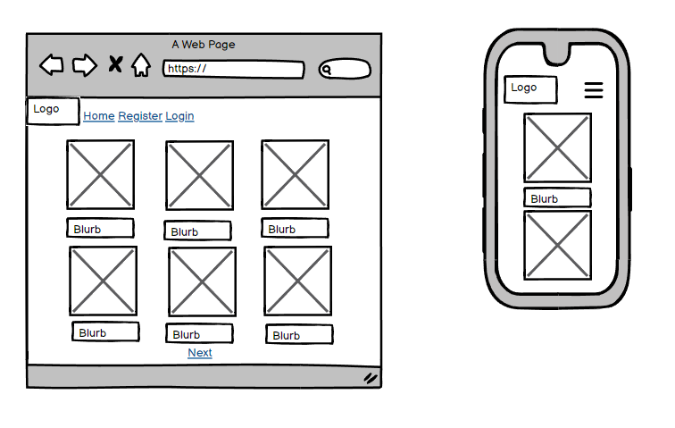

# Gaurav's Book Reviews

Portfolio 4 project as part of the Diploma in Full Stack Software Development by Code Institute. This project uses:
- HTML
- CSS
- JavaScript
- Python+Django

___

Gaurav's Book Reviews is a site that has a library if books, gives users the ability to leave reviews and has an link for them to purchase the book.

It is a fullstack site that allows users to read reviews, create an account and comment on the posts.

Link to live site - [https://gauravs-library-app-55206db4974a.herokuapp.com/](https://gauravs-library-app-55206db4974a.herokuapp.com/)

## CONTENTS

## Site Objectives

Design and create a review site to demonstrate an increasing understanding of the libraries and frameworks available to developers.

My three main objectives were:

- ### Create a readable, clean and responsive front end

  I wanted to make a sute that is easy to access and navigate for the users. Django and Bootstrap were used to create and style the front end.

- ### Make use of available backend functionality

  The use of the backend framework allows users to create a profile, leave a review and/or edit any of the books on the site (with authorisation), as well as deleting their own comments should they wish to.

- ### Store data on an external cloud database

  I used PostgreSQL database for this project.

___

# User Experience/UX

## Target Audience

- Users that are interested like to read reviews before buying books.

## User Stories

### Visitor Goals

- View different books and their reviews
- Access a link to buy a book
- Create an account and engage with the site and other users and site owner.
- Log in and out of their account.
- Read reviews  on each book.
- Leave a review on each book in the "library".
___

# Design Choices

## Colour Scheme

The colour scheme used for this project was based on the colors from Code Institute's 'I think therefore I blog' walkthrough module. I have added and modified many aspects of the styling and colours to suit my site. It is a fairly neutral scheme, with only the actionable aspects (buttons/links etc) displayed in brighter colours for ease of navigation or site use.

## Typography

The main font used is Sans-Serif

## Logo and Favicon

The logo was created using a fonts anf styling

## Wireframes

- Homepage Wireframes

- Book View Wireframes

