# Gaurav's Book Reviews

### Am I responsive

Portfolio 4 project as part of the Diploma in Full Stack Software Development by Code Institute. This project uses:
- HTML
- CSS
- JavaScript
- Python+Django

___

Gaurav's Book Reviews is a site that has a library of books, gives users the ability to leave reviews and has a link for them to purchase the book.

It is a fullstack site that allows users to read reviews, create an account and comment on the posts.

Link to live site - [https://gauravs-library-app-55206db4974a.herokuapp.com/](https://gauravs-library-app-55206db4974a.herokuapp.com/)

## CONTENTS
- [Gaurav's Book Reviews](#gauravs-book-reviews)
    - [Am I Responsive](#am-i-responsive)
  - [CONTENTS](#contents)
  - [Site Objectives](#site-objectives)
- [User Experience/UX](#user-experienceux)
  - [Target Audience](#target-audience)
  - [User Stories](#user-stories)
    - [Visitor Goals](#visitor-goals)
- [Design Choices](#design-choices)
  - [Colour Scheme](#colour-scheme)
  - [Typography](#typography)
  - [Logo and Favicon](#logo-and-favicon)
  - [Wireframes](#wireframes)
  - [Flow Diagram](#flow-diagram)
  - [Database Plan](#database-plan)
- [Features](#features)
  - [Registration](#registration)
  - [Future Features](#future-features)
- [Technologies Used](#technologies-used)
- [Programming Languages, Frameworks and Libraries Used](#programming-languages-frameworks-and-libraries-used)
- [Agile](#agile)
- [Testing](#testing)
  - [Bugs](#bugs)
  - [Lighthouse](#lighthouse)
  - [Validation Testing](#validation-testing)
    - [HTML \& CSS](#html--css)
  - [Python Testing](#python-testing)
  - [Deployment](#deployment)
    - [Github Deployment](#github-deployment)
    - [Cloning and Forking](#cloning-and-forking)
    - [Repository deployment via Heroku](#repository-deployment-via-heroku)
    - [Deployment of the app](#deployment-of-the-app)
  - [Credits](#credits)
  - [Media](#media)
  - [Acknowledgments and Thanks](#acknowledgments-and-thanks)

## Site Objectives

Design and create a review site to demonstrate an increasing understanding of the libraries and frameworks available to developers.

My three main objectives were:

- ### Create a readable, clean and responsive front end

  I wanted to make a site that is easy to access and navigate for the users. Django and Bootstrap were used to create and style the front end.

- ### Make use of available backend functionality

  The use of the backend framework allows users to create a profile, leave a review and/or edit any of the books on the site (with authorisation), as well as deleting their own comments should they wish to.

- ### Store data on an external cloud database

  I used a PostgreSQL database for this project.

___

# User Experience/UX

## Target Audience

- Users who are interested in reading reviews before buying books.

## User Stories

### Visitor Goals

- View different books and their reviews
- Access a link to buy a book
- Create an account and engage with the site and other users and site owner.
- Log in and out of their account.
- Read reviews  on each book.
- Leave a review on each book in the "library".
___

# Design Choices

## Colour Scheme

The colour scheme used for this project was based on the colors from Code Institute's 'I think therefore I blog' walkthrough module. I have added and modified many aspects of the styling and colours to suit my site. It is a fairly neutral scheme, with only the actionable aspects (buttons/links etc) displayed in brighter colours for ease of navigation or site use.

## Typography

The main font used is sans-serif

## Logo and Favicon

The logo was created using fonts and styling

 The favicon was used from font-awesome

## Wireframes

- Homepage Wireframes

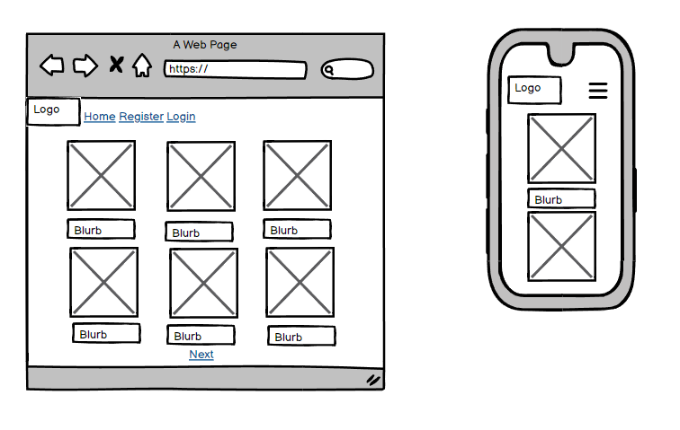

- Book View Wireframes

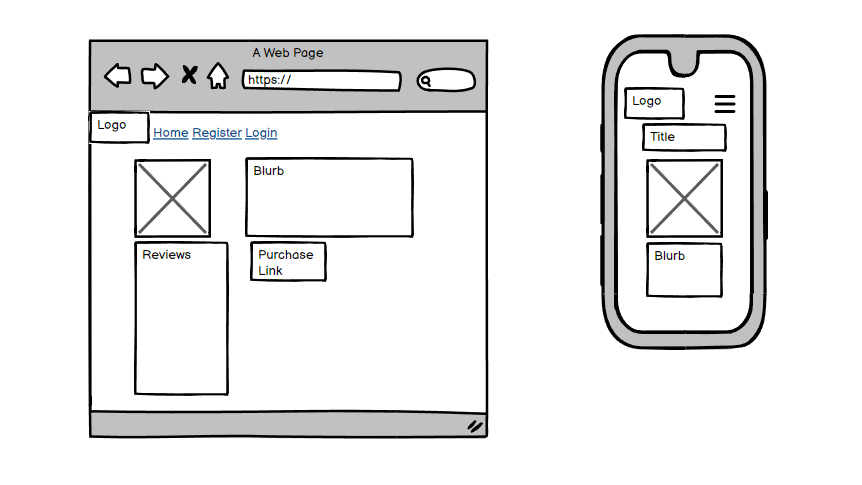

## Flow Diagram

Here is a diagram showing the possible flow through the site. On the left side you can see what the super user can expect to do. On the right hand side you can see what someone who signs up as a user can expect.

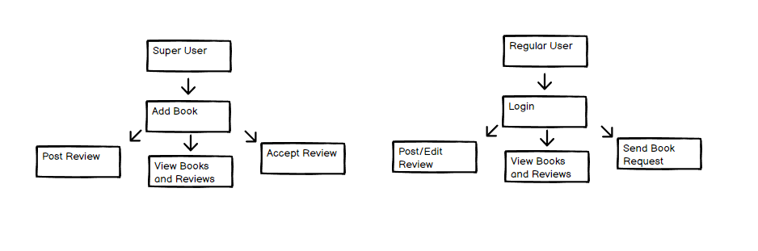

## Database Plan

The database plan is fairly simple, but it shows the information that is stored within the database, the type of data and if it is logged as a Primary or Foreign key where applicable.

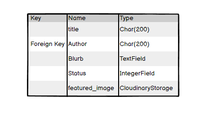

# Features

## Registration

The user can create an account

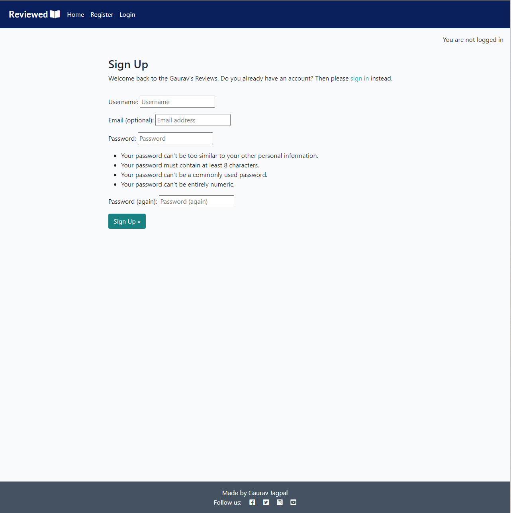

View Book entries on Home Page

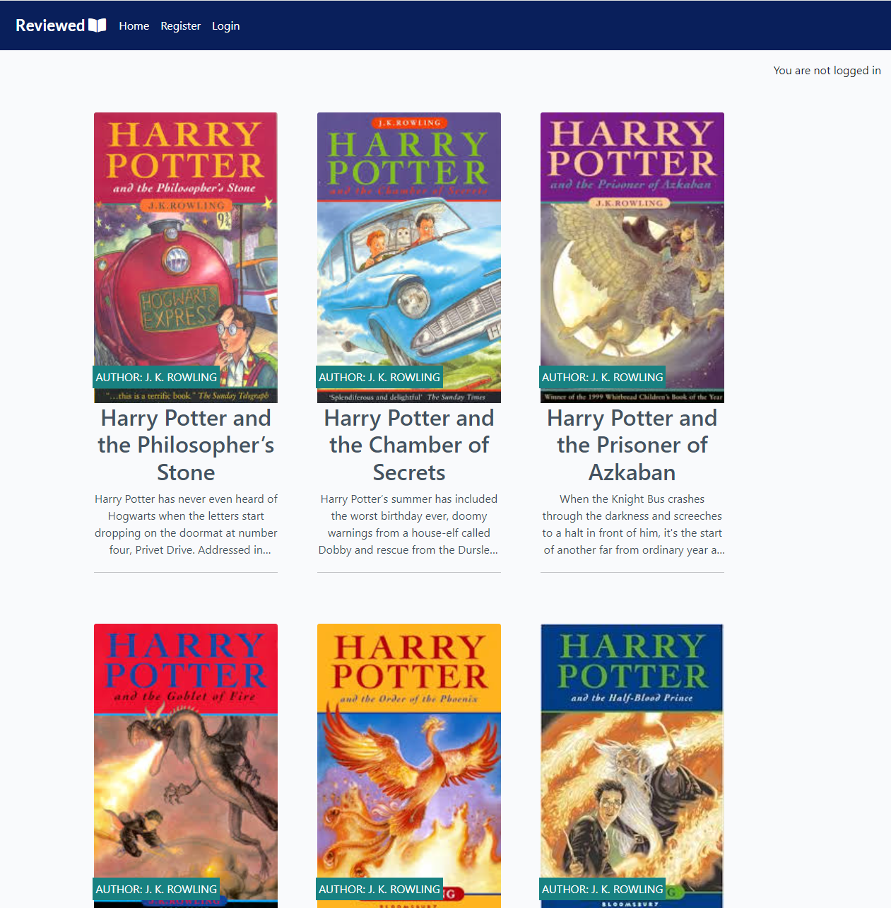

Leave a review on Books.

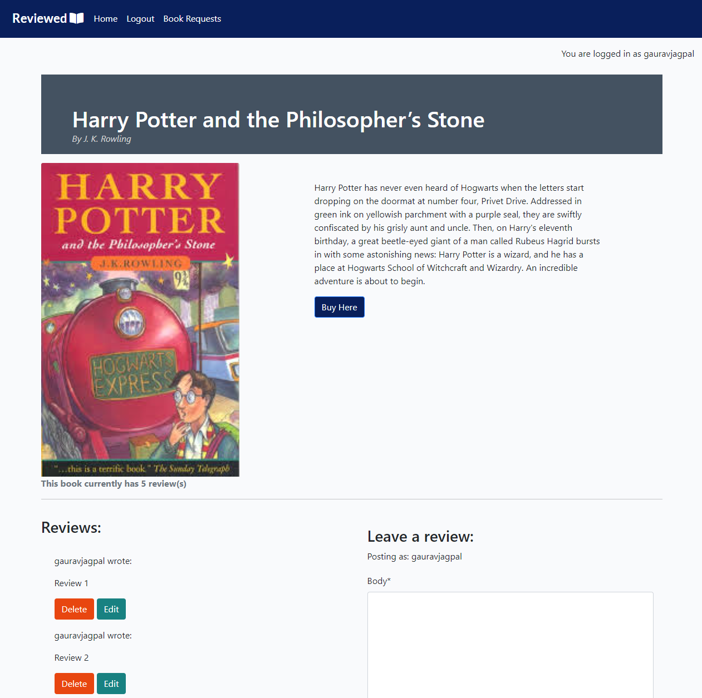

Request books to be added

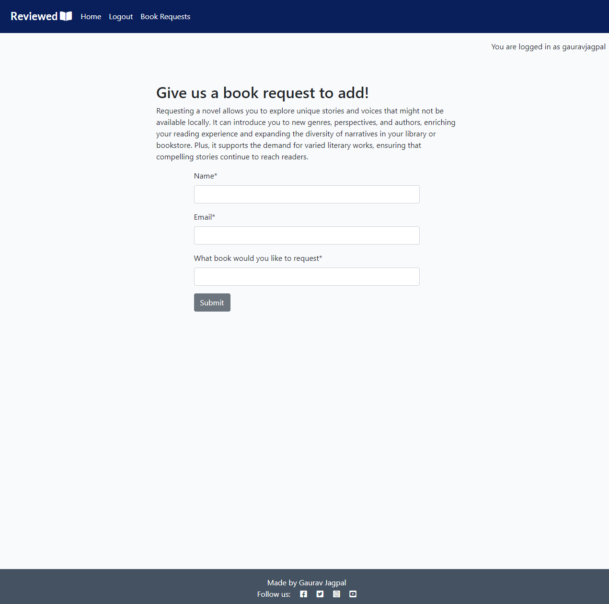

## Future Features

- Add a search bar for users to search on the homepage for a specific book/author
- Add filters to the homepage to make the site more customisable
- Add a downloadable ebook link next to the buy now link on the book-details page
- Social media icons currently there as "dead icons". Purely there for visual. In future as the site expands these will become active.

# Technologies Used

Here are the technologies used to build this project:

- [Github](https://github.com) To host and store the data for the site.
- [Gitpod](https://gitpod.io/workspaces), the IDE where the site was built.
- [PEP8 Validator](https://pep8ci.herokuapp.com/) Used to check python code for errors
- [PostgresSQL](https://dbs.ci-dbs.net/) Used to store PostgreSQL database.
- [Cloudinary](https://cloudinary.com/) Used as cloud storage for images uploaded as part of the blog posts
- [Heroku](https://id.heroku.com/) Used to deploy the project

# Programming Languages, Frameworks and Libraries Used

- [HTML](https://developer.mozilla.org/en-US/docs/Web/HTML)
- [CSS](https://developer.mozilla.org/en-US/docs/Learn/Getting_started_with_the_web/CSS_basics)
- [Python](https://en.wikipedia.org/wiki/Python_(programming_language))
- [Django](https://www.djangoproject.com/)
- [Bootstrap](https://getbootstrap.com/)
- [JavaScript](https://www.javascript.com/)

# Agile

This project was designed using Agile methodology, utilising the Project Board and Issues sections in GitHub

- [Project Board](https://github.com/users/gauravjagpal/projects/2)

# Testing

- [Testing file](TESTING.md)

## Bugs

This project came with a lot of bugs during production - all of which were fixed before final deployment.

Some notable ones:
- Delete button not working when trying to delete a comment
- Update button not working after editing a comment
- Database issue when trying to add a new field, resulting in having to create an instance, delete and then re-create the database.

## Lighthouse

The performance scores appear to be low, and this is due to the cookies and images uploaded for each book having to render in from a third party platform. The Desktop view has higher performance ratings. The best practise score is low across all formats as the cloudinary links are not https.

### Home
#### Mobile

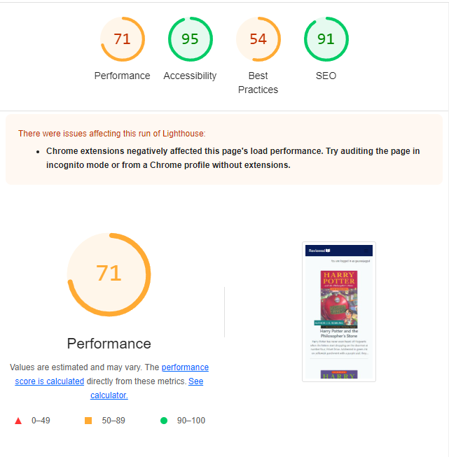

#### Desktop

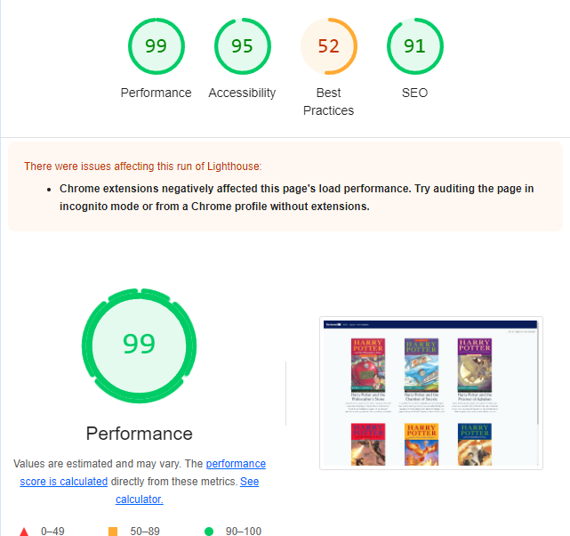

### Home
#### Mobile

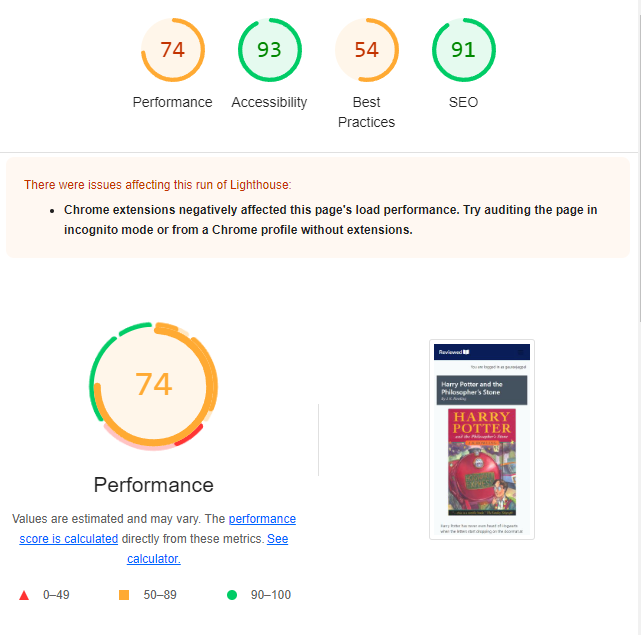

#### Desktop

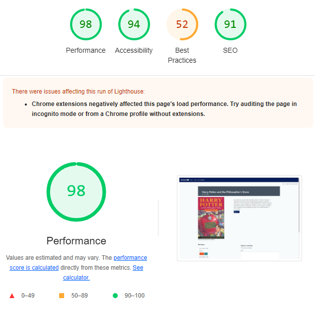

### Book Requests
#### Mobile

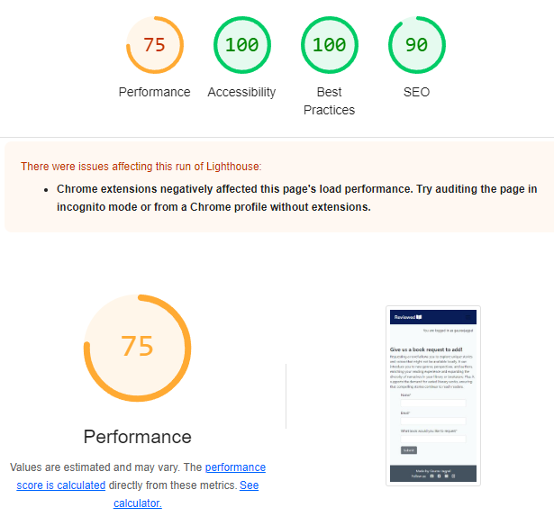

#### Desktop

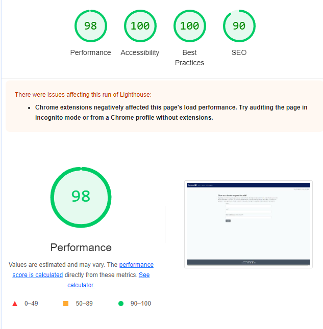

## Deployment

### Github Deployment

The website was stored using GitHub for storage of data and version control. To do this I did the following;

After each addition, change or removal of code, in the terminal within your IDE (I used Gitpod for this project) type:

- git add .
- git commit -m "meaningful commit message"
- git push

The files are now available to view within my github repository.

To bring all models up to date I regularly needed to run:
- python3 manage.py makemigrations
- python3 manage.py migrate

Whenever I made changes to my CSS or JavaScript files I needed to run:
- python3 manage.py collectstatic

## Cloning and Forking
### How to Clone

To clone the repository:

1. Login (or signup) to Github.
2. Go to my repository for the project, [gauravjagpal/library-reviews](https://github.com/gauravjagpal/library-reviews).
3. Click on the green 'Code' button. Choose whether you would like to clone with HTTPS, SSH, or GitHub CLI, and copy the link shown.
4. Launch the terminal within your code editor and set the current working directory to the desired location for the cloned directory.
5. Type 'git clone' into the terminal and then paste the link you copied in step 3. Press enter.

### How to Fork

To fork the repository:

1. Login (or signup) to Github.
2. Go to my repository for the project, [gauravjagpal/library-reviews](https://github.com/gauravjagpal/library-reviews).
3. Click the Fork button in the top right corner.

### Repository deployment via Heroku

- On the [Heroku Dashboard](https://dashboard.heroku.com) page, click New and then select Create New App from the drop-down menu.
- When the next page loads insert the App name and Choose a region. Then click 'Create app'
- In the settings tab click on Reveal Config Vars and add the key Port and the value 8000. The credentials for this app were:

1. Cloudinary URL
2. Database URL
3. SECRET_KEY

- Below this click Add buildpack and choose python.

### Deployment of the app

- Click on the Deploy tab and select Github-Connect to Github.
- Enter the repository name and click Search.
- Choose the repository that holds the correct files and click Connect.
- A choice is offered between manual or automatic deployment whereby the app is updated when changes are pushed to GitHub. Select automatic (when testing you can also choose to do a manual refresh to speed things up)
- Once the deployment method has been chosen the app will be built and can be launched by clicking the Open app button which will either appear below the build information window or in the top right of the page.

___

## Credits

This project was based on the Code Institute's - I think therefore I blog walkthrough module which provided a standard blog 'base'. I used this template and manipulated it into a review site for books, changing view, models and HTML/CSS along the way.

When running into blockers I often referred to Stack Overflow for inspiration

The wireframe mockups were created using [Balsamiq](https://balsamiq.cloud/)

___

## Media

For images of books, I used [Amazon](https://www.amazon.co.uk/) and saved the image directly from there

All other content and images are my own.

___

## Acknowledgments and Thanks

Sean & Oisin at Code Institute's tutor support for the help and guidance with my code-related issues.

Rebecca at Code Institute's tutor support for the database reset guidance on deadline day.