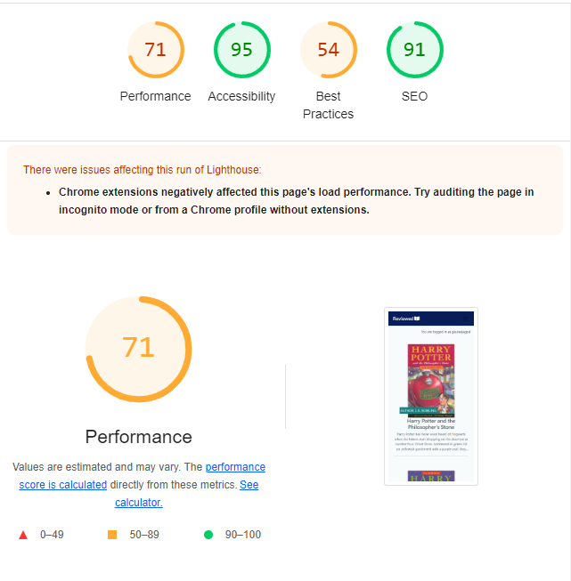
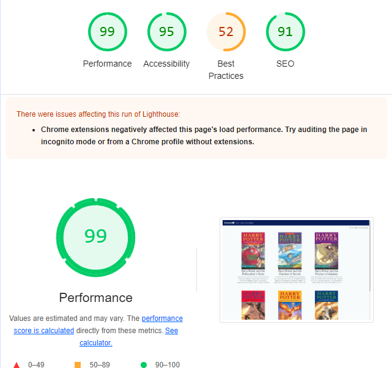
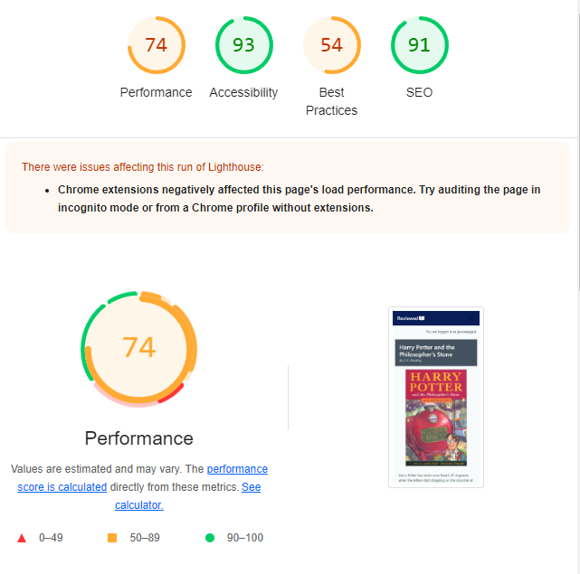
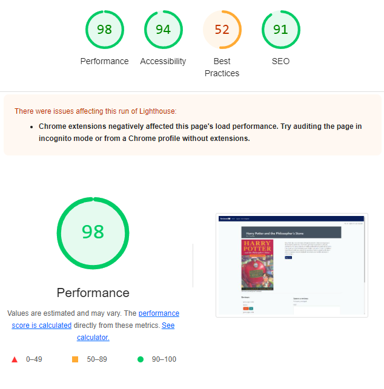
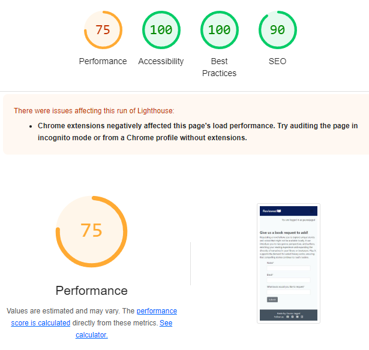

## CONTENTS
  - [Bugs](#bugs)
  - [Lighthouse](#lighthouse)
  - [Validation Testing](#validation-testing)
    - [HTML \& CSS](#html--css)
  - [Python Testing](#python-testing)

## Manual Testing

| TEST | OUTCOME | PASS / FAIL |
|:---:|:---:|:---:|
| Register Account | Account created correctly | PASS |
| log in | log in correctly | PASS |
| log out | log out correctly | PASS |
| Add Review | Add Review goes to admin for approval | PASS |
| Delete Review | Deletes Review | PASS |
| Edit Review | Review sent to admin for approval | PASS |
| Book Requests | Goes to admin panel to add a new book | PASS |

## Bugs

This project came with a lot of bugs during production - all of which were fixed before final deployment.

Some notable ones:
- Delete button not working when trying to delete a comment
- Update button not working after editing a comment
- Database issue when trying to add a new field, resulting in having to create an instance, delete and then re-create the database.

## Lighthouse

The performance scores appear to be low, and this is due to the cookies and images uploaded for each book having to render in from a third party platform. The Desktop view has higher performance ratings. The best practise score is low across all formats as the cloudinary links are not https.

### Home
#### Mobile

#### Desktop

### Home
#### Mobile

#### Desktop

### Book Requests
#### Mobile

#### Desktop

